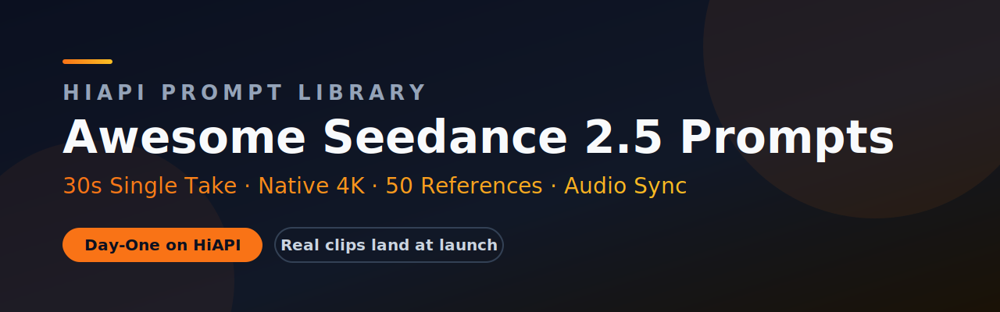

<div align="center">

<a href="https://www.hiapi.ai/en?utm_source=github&utm_medium=readme&utm_campaign=awesome-seedance-2-5-prompts"></a>

[](https://www.hiapi.ai/en?utm_source=github&utm_medium=readme&utm_campaign=awesome-seedance-2-5-prompts) [](https://www.hiapi.ai/en/register?utm_source=github&utm_medium=readme&utm_campaign=awesome-seedance-2-5-prompts) [](https://www.hiapi.ai/en/models?utm_source=github&utm_medium=readme&utm_campaign=awesome-seedance-2-5-prompts) [](https://docs.hiapi.ai/?utm_source=github&utm_medium=readme&utm_campaign=awesome-seedance-2-5-prompts)

   

# Awesome Seedance 2.5 Prompts

**A bilingual Seedance 2.5 prompt library for AI video creators, developers, and agents.**

[Run with HiAPI](https://www.hiapi.ai/en/register?utm_source=github&utm_medium=readme&utm_campaign=awesome-seedance-2-5-prompts) · [Seedance 2.5 API docs](https://docs.hiapi.ai/models/video/seedance-2-5/?utm_source=github&utm_medium=readme&utm_campaign=awesome-seedance-2-5-prompts) · [Seedance Python SDK](https://github.com/HiAPIAI/hiapi-seedance-python) · [Browse data](./data/official-cases.json) · [中文](README.zh-CN.md) · [Seedance 2.0 prompts](https://github.com/HiAPIAI/awesome-seedance-2-0-prompts) · [Video skill](https://github.com/HiAPIAI/hiapi-seedance-2-0-video-skill)

*Seedance 2.5 prompts · AI video prompt examples · text-to-video prompts · image-to-video prompts · 30-second video prompts · HiAPI video API*

</div>

> **HiAPI Matrix:** [Image Prompts](https://github.com/HiAPIAI/awesome-gpt-image-2-prompts) · [Seedance 2.0 Prompts](https://github.com/HiAPIAI/awesome-seedance-2-0-prompts) · **Seedance 2.5 Prompts** · [Seedance Python SDK](https://github.com/HiAPIAI/hiapi-seedance-python) · [Agent Skills](https://github.com/HiAPIAI/hiapi-skills) · [Remote MCP](https://docs.hiapi.ai/for-ai/) · [API Docs](https://docs.hiapi.ai)

## Why This Repo

Seedance 2.5 changes how video prompts are written. A short AI video prompt can describe one shot; a Seedance 2.5 prompt can direct a longer scene with continuity, references, text rendering, editing, audio rhythm, and a visible payoff. This repository turns those patterns into a practical, searchable library.

What you get:

- **15 Seedance 2.5 video case indexes** with direct MP4 links, aspect ratios, reference materials, and prompt themes.
- **10 HiAPI-authored launch templates** in [`data/templates.json`](./data/templates.json), ready to adapt for product films, dialogue scenes, sports shots, ASMR, architecture, music, and time-lapse worlds.
- **Bilingual SEO pages** for English and Chinese users searching for Seedance 2.5 prompts, AI video prompts, text-to-video prompt examples, image-to-video references, and 30-second video prompt structures.
- **HiAPI API handoff** so a prompt can move from inspiration to an actual generation request when Seedance 2.5 is available through HiAPI.

> Prompt text from third-party source pages is not mirrored here in full. This repo indexes the cases and links back to the source page so you can copy the original prompt without modification. See [Sources and rights](#sources-and-rights).

## Case Gallery

Click any preview image to open and play the MP4. The videos stay on the source CDN; this repository does not re-host the video files.

| Preview | Case |
|---|---|
| [](https://ark-common-storage-prod-cn-beijing.tos-cn-beijing.volces.com/presets/experience/gen_video/model-promotion/seedance-2-5/firstScreen/group1/1.mp4) | **1. Crystal Ball Match-Cut Film**<br>A fixed crystal ball with a Seedance mark stays sharp while scenes switch rapidly to electronic beats.<br><sub>text-to-video · 16:9</sub> |
| [](https://ark-common-storage-prod-cn-beijing.tos-cn-beijing.volces.com/presets/experience/gen_video/model-promotion/seedance-2-5/firstScreen/group3/output.mp4) | **2. Window Motif Brand Film**<br>A reference-guided sequence moves through window-like motifs, water, fish, garden windows, stained glass, and eyes.<br><sub>image-to-video · 16:9</sub> |
| [](https://ark-common-storage-prod-cn-beijing.tos-cn-beijing.volces.com/presets/experience/gen_video/model-promotion/seedance-2-5/firstScreen/group2/2.mp4) | **3. Steampunk Ornithopter One-Take**<br>A 30-second continuous steampunk miniature journey through gears, an ornithopter, a zoetrope, a cable car, glass waves, and a moon ridge.<br><sub>text-to-video · 16:9 · 30s</sub> |
| [](https://ark-common-storage-prod-cn-beijing.tos-cn-beijing.volces.com/presets/experience/gen_video/model-promotion/seedance-2-5/part1/tab1/group1/output.mp4) | **4. Six Connected Rooms**<br>A black-coated character walks across six rooms with the same structure but changing moods, visual styles, and reference-driven events.<br><sub>image-to-video · 16:9 · 30s</sub> |
| [](https://ark-common-storage-prod-cn-beijing.tos-cn-beijing.volces.com/presets/experience/gen_video/model-promotion/seedance-2-5/part2/group1/output.mp4) | **5. Energy Bow Video Edit**<br>A reference video keeps its character, motion, camera, and duration while an electric bow and arrow are added.<br><sub>video-editing · 16:9</sub> |
| [](https://ark-common-storage-prod-cn-beijing.tos-cn-beijing.volces.com/presets/experience/gen_video/model-promotion/seedance-2-5/part3/group1/output.mp4) | **6. FPV Multilingual Hello**<br>A continuous FPV drone path forms eleven language greetings through clouds, fog, ribbons, waterfalls, reflections, fields, architecture, and fountains.<br><sub>image-to-video · 16:9 · 33s</sub> |
| [](https://ark-common-storage-prod-cn-beijing.tos-cn-beijing.volces.com/presets/experience/gen_video/model-promotion/seedance-2-5/ugc/16-9/169-1.mp4) | **7. Creative Multilingual Text Loop**<br>A seamless loop where the idea of creation appears across multiple languages and visual-material styles.<br><sub>text-to-video · 16:9 · 15s</sub> |
| [](https://ark-common-storage-prod-cn-beijing.tos-cn-beijing.volces.com/presets/experience/gen_video/model-promotion/seedance-2-5/ugc/3-4/34-1.mp4) | **8. Haute Couture Bokeh Film**<br>A high-fashion cinematic sequence built around macro light, piano performance, garden motion, slow reading, bubbles, and material detail.<br><sub>text-to-video · 3:4 · 30s</sub> |
| [](https://ark-common-storage-prod-cn-beijing.tos-cn-beijing.volces.com/presets/experience/gen_video/model-promotion/seedance-2-5/ugc/1-1/11-1.mp4) | **9. Deep-Sea Jellyfish Seedance**<br>A blue coral reef scene adds softly glowing jellyfish and bubbles that form the word Seedance.<br><sub>text-to-video · 1:1</sub> |
| [](https://ark-common-storage-prod-cn-beijing.tos-cn-beijing.volces.com/presets/experience/gen_video/model-promotion/seedance-2-5/ugc/1-1/11-2.mp4) | **10. Floating Desert Gallery**<br>A minimalist white gallery floats above a golden desert, with the camera entering the surreal interior and opening back to sky.<br><sub>text-to-video · 1:1</sub> |
| [](https://ark-common-storage-prod-cn-beijing.tos-cn-beijing.volces.com/presets/experience/gen_video/model-promotion/seedance-2-5/ugc/16-9/169-2.mp4) | **11. Desert Brand Concept Film**<br>A 30-second high-end desert fashion film uses inverted perspective, macro fashion details, LED stage reveal, and moonlit texture closeups.<br><sub>text-to-video · 16:9 · 30s</sub> |
| [](https://ark-common-storage-prod-cn-beijing.tos-cn-beijing.volces.com/presets/experience/gen_video/model-promotion/seedance-2-5/ugc/3-4/34-2.mp4) | **12. Peking Opera Heritage Short**<br>A warm, restrained heritage film follows a master and apprentice through Peking opera craft, costume, and handover.<br><sub>text-to-video · 3:4</sub> |
| [](https://ark-common-storage-prod-cn-beijing.tos-cn-beijing.volces.com/presets/experience/gen_video/model-promotion/seedance-2-5/ugc/16-9/169-3.mp4) | **13. Theater of Oceanic Civilization**<br>An epic sci-fi ocean civilization sequence descends into deep ruins, awakens a sculptural lifeform, raises a temple ship, and pulls back to cosmic scale.<br><sub>text-to-video · 16:9 · 30s</sub> |
| [](https://ark-common-storage-prod-cn-beijing.tos-cn-beijing.volces.com/presets/experience/gen_video/model-promotion/seedance-2-5/ugc/1-1/11-3.mp4) | **14. Mechanical Bloom**<br>A one-take macro push starts from a dark metal bud, enters precise mechanical petals, and climaxes with a full luminous bloom.<br><sub>text-to-video · 1:1</sub> |
| [](https://ark-common-storage-prod-cn-beijing.tos-cn-beijing.volces.com/presets/experience/gen_video/model-promotion/seedance-2-5/ugc/3-4/34-3.mp4) | **15. Silk Road Pomegranate Journey**<br>A rock-color flat animation follows pomegranate from branch, Silk Road travel, modern table, juice making, and poster-like close.<br><sub>text-to-video · 3:4 · 30s</sub> |

Structured metadata lives in [`data/official-cases.json`](./data/official-cases.json): video URLs, preview snapshots, reference images/videos, tags, categories, and prompt themes.

## Prompt Patterns

Use these as search and writing anchors when building your own Seedance 2.5 prompts:

| Pattern | Use it for | Strong case examples |
|---|---|---|
| 30-second single take | One continuous scene with setup, transformation, and payoff | Steampunk Ornithopter, Six Connected Rooms |
| Match-cut rhythm | Fast background changes locked to music while the subject stays fixed | Crystal Ball Match-Cut |
| Multi-reference control | Keeping multiple images aligned across a full clip | Window Motif Brand Film, Six Connected Rooms |
| Controlled video edit | Changing one visual layer while keeping motion and timing intact | Energy Bow Video Edit |
| Text inside the scene | Multilingual words formed by clouds, fog, water, architecture, or typography | FPV Multilingual Hello, Creative Multilingual Text Loop |
| High-end brand film | Fashion, product, architecture, material closeups, and cinematic transitions | Haute Couture Bokeh, Desert Brand Concept Film, Floating Desert Gallery |
| Stylized animation | Non-photoreal flat art with texture, story, and visual rhythm | Silk Road Pomegranate Journey |

## HiAPI Launch Templates

The repository also includes 10 HiAPI-authored prompt templates designed for Seedance 2.5-style workloads. Unlike the indexed preview cases above, these are original templates and are included in full in [`data/templates.json`](./data/templates.json).

| # | Template | Capability | Duration |
|---|---|---|---|
| 1 | The 30-Second One-Take Product Story | text-to-video | 30s |
| 2 | Fifty-Reference Brand World | image-to-video | 20s |
| 3 | Dialogue Scene with Native Audio Sync | text-to-video | 25s |
| 4 | The Impossible Sports Broadcast | text-to-video | 30s |
| 5 | Single-Take Cooking ASMR | text-to-video | 30s |
| 6 | Character-Consistent Micro-Film | image-to-video | 30s |
| 7 | The 4K Texture Torture Test | text-to-video | 20s |
| 8 | Audio-Led Music Performance | image-to-video | 20s |
| 9 | Architectural Walkthrough from a 3D White Model | image-to-video | 30s |
| 10 | The Season-Cycle Time Compression | text-to-video | 30s |

## Run a Prompt with HiAPI

When Seedance 2.5 is available through HiAPI, the workflow is simple: pick a case pattern, paste or adapt a prompt, and send it to the unified task API.

```bash
curl -X POST "https://api.hiapi.ai/v1/tasks" \
  -H "Authorization: Bearer $HIAPI_API_KEY" \
  -H "Content-Type: application/json" \
  -d '{
    "model": "seedance-2-5",
    "input": {
      "prompt": "Paste your Seedance 2.5 prompt here",
      "duration": 30,
      "resolution": "1080p",
      "aspect_ratio": "16:9"
    }
  }'
```

Python developers can use the focused Seedance SDK:

```bash
pip install hiapi-seedance
```

```python
from hiapi_seedance import Seedance

client = Seedance()
task = client.text_to_video(
    prompt="Paste your Seedance 2.5 prompt here",
    duration=30,
    aspect_ratio="16:9",
)
print(task.output[0].url)
```

For agent workflows, install the video skill:

```bash
npx -y github:HiAPIAI/hiapi-seedance-2-0-video-skill -y
# the Seedance 2.5 skill ships here the day the model opens
```

Links:

- [Get a HiAPI API key](https://www.hiapi.ai/en/register?utm_source=github&utm_medium=readme&utm_campaign=awesome-seedance-2-5-prompts)
- [HiAPI pricing](https://www.hiapi.ai/en/pricing?utm_source=github&utm_medium=readme&utm_campaign=awesome-seedance-2-5-prompts)
- [Seedance 2.5 API docs — release date, specs, day-one access](https://docs.hiapi.ai/models/video/seedance-2-5/?utm_source=github&utm_medium=readme&utm_campaign=awesome-seedance-2-5-prompts)
- [HiAPI API docs](https://docs.hiapi.ai/?utm_source=github&utm_medium=readme&utm_campaign=awesome-seedance-2-5-prompts)
- [Seedance Python SDK](https://github.com/HiAPIAI/hiapi-seedance-python)
- [Seedance video generation skill](https://github.com/HiAPIAI/hiapi-seedance-2-0-video-skill) — the 2.5 edition ships at launch

## SEO Index

This repo is intentionally optimized for searchers looking for:

- Seedance 2.5 prompts
- Seedance 2.5 prompt library
- Seedance 2.5 video prompt examples
- AI video prompt library
- text-to-video prompt examples
- image-to-video reference prompts
- 30 second AI video prompts
- cinematic AI video prompts
- multilingual AI video text prompts
- AI video advertising prompts
- HiAPI Seedance video API
- Seedance 2.5 API examples
- Seedance Python SDK
- Seedance 2.5 API Python

Chinese page: [Seedance 2.5 提示词库](README.zh-CN.md)

## Contributing

Submit reusable prompts, case links, or corrections through [CONTRIBUTING.md](./CONTRIBUTING.md). Keep the prompt reproducible, include a working video URL when available, and preserve source metadata for any third-party material.

## Sources and Rights

The preview case index links to the public Seedance 2.5 promotion page and its visible case assets. HiAPI owns the curation, README structure, original launch templates, scripts, and JSON schema. Third-party source prompts, videos, images, brand names, and platform names are not relicensed by this repository. See [NOTICE.md](./NOTICE.md) for the full source and rights notice.

Seedance is a ByteDance model. This repository is an independent prompt library and is not affiliated with or endorsed by ByteDance.

## License

HiAPI-owned repository materials are released under [CC BY 4.0](LICENSE), with third-party material excluded as described in [NOTICE.md](NOTICE.md).
