<div align="center">

<a href="https://www.hiapi.ai/zh?utm_source=github&utm_medium=readme&utm_campaign=awesome-seedance-2-5-prompts"></a>

[](README.md) [](README.zh-CN.md)

[](https://www.hiapi.ai/zh?utm_source=github&utm_medium=readme&utm_campaign=awesome-seedance-2-5-prompts) [](https://www.hiapi.ai/zh/register?utm_source=github&utm_medium=readme&utm_campaign=awesome-seedance-2-5-prompts) [](https://docs.hiapi.ai/zh/models/video/seedance-2-5/?utm_source=github&utm_medium=readme&utm_campaign=awesome-seedance-2-5-prompts)

</div>

# 🎬 Awesome Seedance 2.5 Prompts

精选字节跳动 Seedance 2.5 高质量视频生成提示词,覆盖电影级叙事、品牌短片、参考驱动生成、多语种文字动画与可控视频编辑。

---

## 📖 目录

- [🌐 试用 Seedance 2.5](#try)
- [🤔 Seedance 2.5 是什么?](#what)
- [⭐ 精选提示词](#featured)
- [🎬 全部提示词](#all)
- [🚀 用 API 运行提示词](#run)
- [🤝 参与贡献](#contribute)
- [📄 许可](#license)

---

<a id="try"></a>
## 🌐 试用 Seedance 2.5

<div align="center">

**[Seedance 2.5 API 文档 —— 发布时间、规格、发售即支持](https://docs.hiapi.ai/zh/models/video/seedance-2-5/?utm_source=github&utm_medium=readme&utm_campaign=awesome-seedance-2-5-prompts)** · **[免费获取 HiAPI API Key](https://www.hiapi.ai/zh/register?utm_source=github&utm_medium=readme&utm_campaign=awesome-seedance-2-5-prompts)**

</div>

---

<a id="what"></a>
## 🤔 Seedance 2.5 是什么?

Seedance 2.5 是字节跳动新一代 Seedance 视频模型,面向更长、更丰富、更高分辨率、更可控的 AI 视频生产,尤其适合电影级提示词、品牌短片、多参考场景与定向视频编辑。完整模型指南见 [Seedance 2.5 API 文档](https://docs.hiapi.ai/zh/models/video/seedance-2-5/?utm_source=github&utm_medium=readme&utm_campaign=awesome-seedance-2-5-prompts)。

**核心能力:**

- 🎬 **30 秒原生视频** —— 更长的单镜头输出,适合广告、产品演示、品牌片与叙事场景。
- 🧩 **丰富的多模态参考** —— 用角色图、产品素材、风格板、动作片段、音频指令与 3D 参考控制生成。
- ✂️ **可控视频编辑** —— 在保留原始运动与节奏的前提下替换背景、更换产品、添加特效。
- 📐 **原生 4K 画质** —— 更流畅的运动、更强的角色一致性、更高的提示词遵循度与 10-bit 色深。
- 🔁 **灵活工作流** —— 文生视频、图生视频、多参考生成、首尾帧关键帧与定向编辑。

---

<a id="featured"></a>
## ⭐ 精选提示词

> 精选首屏案例 —— 完整提示词,复制即用。

### No. 1: 水晶球卡点转场短片


#### 📖 案例说明

水晶球主体固定清晰，背景随电子节拍高速无缝切换。

#### 📝 提示词

```
一部配合动感电子节拍的快节奏、电影级无缝转场（Match-cut）短片。画面正中始终固定一颗完美无瑕的水晶球，内部刻有发光的‘seedance’标志。水晶球保持极致对焦，随着强劲的音乐鼓点，背景高速无缝切换：
场景1： 微距特写，电影质感的水花在水晶球周围飞溅，折射复杂光影。
场景2： 晨间复古咖啡馆，水晶球置于原木桌面，背景是升腾的咖啡热气与窗外模糊的通勤人流。
场景3： 傍晚黄金时刻，滑板青年单手抛握水晶球，背景为极速倒退的街景与绝美的夕阳逆光。
场景4： 狂热音乐节现场，人手高举水晶球，折射出背景绚丽的舞台激光。
场景5： 热闹的家庭派对餐桌，水晶球静置中央，背景是欢聚干杯、拿取食物的模糊人影。
场景6： 昏暗电影院中，双手捧着水晶球，巨大银幕的微光在其表面流转。
场景7： 水晶球置于强烈震动的音响振膜上，随音乐高潮无缝切换至旋转的DJ打碟机中央。
场景8： 户外露营之夜，背景化作温暖的篝火与摇曳的灯串光斑（Bokeh）。
抛起落幕： 随音乐最终重音，水晶球被高高抛出画面上方；瞬间切至纯黑背景，画面正中浮现极简的黑底白字“seedance”，
紧贴动感BGM律动剪辑（卡点转场），顶级电影感调色（Cinematic Color Grading）。逼真的玻璃折射与透射材质，复杂光线追踪（Ray tracing），全局照明。主体极致清晰，背景带有强烈的动态模糊，视觉冲击力极强。
```

#### 🎬 视频

<div align="center">

<a href="https://docs.hiapi.ai/zh/models/video/seedance-2-5/?utm_source=github&utm_medium=case&utm_campaign=awesome-seedance-2-5-prompts">
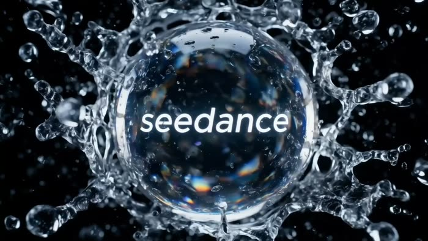
</a>

**[用 Seedance 2.5 API 生成同款 →](https://docs.hiapi.ai/zh/models/video/seedance-2-5/?utm_source=github&utm_medium=case&utm_campaign=awesome-seedance-2-5-prompts)**

</div>

#### 📌 参数

- **适用能力:** 文生视频
- **画幅:** 16:9

---

### No. 2: 窗景意象品牌短片


#### 📖 案例说明

以参考图串联车窗、水下、花窗、彩窗、眼睛等窗口意象。

#### 📝 提示词

```
电影级品牌概念短片。<<<image_1_1>>>为首帧，画面微微晃动，镜头逐渐推近，来到窗外快速后退的树影，树影后退速度越来愈快，突然切到<<<image_2_2>>>，速度突然放缓，镜头顺着溪流缓缓前进，鸟语花香。
镜头下移，来到水下，音效有水中气泡的声音，一群橙色的水母从镜头前优美地游过<<<image_3_3>>>，镜头缓缓后拉，有一群小鱼晃过镜头后从水里穿到窗内<<<image_4_4>>>，少女左看右看，在观赏小鱼
镜头缓缓后拉，画面虚焦，随后又重新对焦画面变清晰，跟随音乐节奏切换：中式园林花窗<<<image_5_5>>>光线转圈、教堂玻璃彩窗、飞机舷窗、穹顶天窗、飘窗、百叶窗、欧洲老虎窗、门上猫眼、相机取景框、鸟类眼睛、人类眼睛特写。
画面停留在人类眼睛特写，随后眼睛闭上，画面黑屏，再突然一睁眼，眼睛中央出现“seedance”带重音
```

#### 🎬 视频

<div align="center">

<a href="https://docs.hiapi.ai/zh/models/video/seedance-2-5/?utm_source=github&utm_medium=case&utm_campaign=awesome-seedance-2-5-prompts">
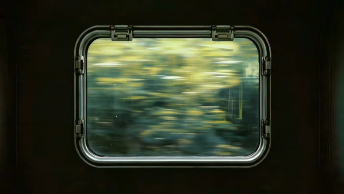
</a>

**[用 Seedance 2.5 API 生成同款 →](https://docs.hiapi.ai/zh/models/video/seedance-2-5/?utm_source=github&utm_medium=case&utm_campaign=awesome-seedance-2-5-prompts)**

</div>

#### 📌 参数

- **适用能力:** 图生视频
- **画幅:** 16:9

---

### No. 3: 蒸汽朋克扑翼机一镜到底


#### 📖 案例说明

30 秒连续穿梭蒸汽朋克微缩世界，包含齿轮、扑翼机、幻影箱、缆车、玻璃海浪和月光山脊。

#### 📝 提示词

```
一段高级、极具电影感的30秒3D动态图形序列，采用精致的蒸汽朋克与复古微缩景观风格，配合连续流畅的环绕与穿透运镜。
[0-10秒]： 古董黄铜钟面微距特写，奇迹般层层展开为相互啮合的旋转齿轮环与体积雾。镜头向下穿透齿轮，一架机械扑翼机（Ornithopter），正从由做旧古籍堆叠而成的微缩峡谷中盘旋升空。
[10-20秒]： 镜头跟随扑翼机的轨迹向前滑行，无缝穿透入一个高速旋转的华丽黄铜幻影箱（Zoetrope），内部投射出飞驰的机械骏马动态光影。光影跃出箱体，场景瞬间化为一辆黄铜质感悬浮缆车，正沿着微光铜轨穿梭于机械齿轮森林，沐浴着电影级的黄金时刻光线。
[20-30秒]： 镜头优雅向下平移，缆车下方出现一艘精美的发条木制机械帆船，在深蓝色玻璃材质的起伏海浪中破浪前行。海浪尽头无缝演变为一轮发光巨月，一群举着摇曳提灯的探险者剪影，正沿着星空下的水晶矿脉山脊艰难跋涉。镜头平滑螺旋拉远，穿过空灵云朵，回到滴答作响的宏大黄铜钟面。
技术规格： 超写实机械纹理，丰富黄铜与金色调，电影级浅景深。平滑连贯的无缝穿梭运镜，极强的史诗感与奇幻冒险氛围。
```

#### 🎬 视频

<div align="center">

<a href="https://docs.hiapi.ai/zh/models/video/seedance-2-5/?utm_source=github&utm_medium=case&utm_campaign=awesome-seedance-2-5-prompts">
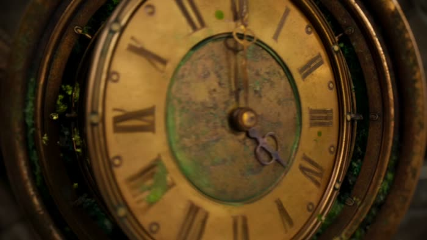
</a>

**[用 Seedance 2.5 API 生成同款 →](https://docs.hiapi.ai/zh/models/video/seedance-2-5/?utm_source=github&utm_medium=case&utm_campaign=awesome-seedance-2-5-prompts)**

</div>

#### 📌 参数

- **适用能力:** 文生视频 · 30 秒
- **画幅:** 16:9

---


<a id="all"></a>
## 🎬 全部提示词

### No. 1: 水晶球卡点转场短片


#### 📖 案例说明

水晶球主体固定清晰，背景随电子节拍高速无缝切换。

#### 📝 提示词

```
一部配合动感电子节拍的快节奏、电影级无缝转场（Match-cut）短片。画面正中始终固定一颗完美无瑕的水晶球，内部刻有发光的‘seedance’标志。水晶球保持极致对焦，随着强劲的音乐鼓点，背景高速无缝切换：
场景1： 微距特写，电影质感的水花在水晶球周围飞溅，折射复杂光影。
场景2： 晨间复古咖啡馆，水晶球置于原木桌面，背景是升腾的咖啡热气与窗外模糊的通勤人流。
场景3： 傍晚黄金时刻，滑板青年单手抛握水晶球，背景为极速倒退的街景与绝美的夕阳逆光。
场景4： 狂热音乐节现场，人手高举水晶球，折射出背景绚丽的舞台激光。
场景5： 热闹的家庭派对餐桌，水晶球静置中央，背景是欢聚干杯、拿取食物的模糊人影。
场景6： 昏暗电影院中，双手捧着水晶球，巨大银幕的微光在其表面流转。
场景7： 水晶球置于强烈震动的音响振膜上，随音乐高潮无缝切换至旋转的DJ打碟机中央。
场景8： 户外露营之夜，背景化作温暖的篝火与摇曳的灯串光斑（Bokeh）。
抛起落幕： 随音乐最终重音，水晶球被高高抛出画面上方；瞬间切至纯黑背景，画面正中浮现极简的黑底白字“seedance”，
紧贴动感BGM律动剪辑（卡点转场），顶级电影感调色（Cinematic Color Grading）。逼真的玻璃折射与透射材质，复杂光线追踪（Ray tracing），全局照明。主体极致清晰，背景带有强烈的动态模糊，视觉冲击力极强。
```

#### 🎬 视频

<div align="center">

<a href="https://docs.hiapi.ai/zh/models/video/seedance-2-5/?utm_source=github&utm_medium=case&utm_campaign=awesome-seedance-2-5-prompts">

</a>

**[用 Seedance 2.5 API 生成同款 →](https://docs.hiapi.ai/zh/models/video/seedance-2-5/?utm_source=github&utm_medium=case&utm_campaign=awesome-seedance-2-5-prompts)**

</div>

#### 📌 参数

- **适用能力:** 文生视频
- **画幅:** 16:9

---

### No. 2: 窗景意象品牌短片


#### 📖 案例说明

以参考图串联车窗、水下、花窗、彩窗、眼睛等窗口意象。

#### 📝 提示词

```
电影级品牌概念短片。<<<image_1_1>>>为首帧，画面微微晃动，镜头逐渐推近，来到窗外快速后退的树影，树影后退速度越来愈快，突然切到<<<image_2_2>>>，速度突然放缓，镜头顺着溪流缓缓前进，鸟语花香。
镜头下移，来到水下，音效有水中气泡的声音，一群橙色的水母从镜头前优美地游过<<<image_3_3>>>，镜头缓缓后拉，有一群小鱼晃过镜头后从水里穿到窗内<<<image_4_4>>>，少女左看右看，在观赏小鱼
镜头缓缓后拉，画面虚焦，随后又重新对焦画面变清晰，跟随音乐节奏切换：中式园林花窗<<<image_5_5>>>光线转圈、教堂玻璃彩窗、飞机舷窗、穹顶天窗、飘窗、百叶窗、欧洲老虎窗、门上猫眼、相机取景框、鸟类眼睛、人类眼睛特写。
画面停留在人类眼睛特写，随后眼睛闭上，画面黑屏，再突然一睁眼，眼睛中央出现“seedance”带重音
```

#### 🎬 视频

<div align="center">

<a href="https://docs.hiapi.ai/zh/models/video/seedance-2-5/?utm_source=github&utm_medium=case&utm_campaign=awesome-seedance-2-5-prompts">

</a>

**[用 Seedance 2.5 API 生成同款 →](https://docs.hiapi.ai/zh/models/video/seedance-2-5/?utm_source=github&utm_medium=case&utm_campaign=awesome-seedance-2-5-prompts)**

</div>

#### 📌 参数

- **适用能力:** 图生视频
- **画幅:** 16:9

---

### No. 3: 蒸汽朋克扑翼机一镜到底


#### 📖 案例说明

30 秒连续穿梭蒸汽朋克微缩世界，包含齿轮、扑翼机、幻影箱、缆车、玻璃海浪和月光山脊。

#### 📝 提示词

```
一段高级、极具电影感的30秒3D动态图形序列，采用精致的蒸汽朋克与复古微缩景观风格，配合连续流畅的环绕与穿透运镜。
[0-10秒]： 古董黄铜钟面微距特写，奇迹般层层展开为相互啮合的旋转齿轮环与体积雾。镜头向下穿透齿轮，一架机械扑翼机（Ornithopter），正从由做旧古籍堆叠而成的微缩峡谷中盘旋升空。
[10-20秒]： 镜头跟随扑翼机的轨迹向前滑行，无缝穿透入一个高速旋转的华丽黄铜幻影箱（Zoetrope），内部投射出飞驰的机械骏马动态光影。光影跃出箱体，场景瞬间化为一辆黄铜质感悬浮缆车，正沿着微光铜轨穿梭于机械齿轮森林，沐浴着电影级的黄金时刻光线。
[20-30秒]： 镜头优雅向下平移，缆车下方出现一艘精美的发条木制机械帆船，在深蓝色玻璃材质的起伏海浪中破浪前行。海浪尽头无缝演变为一轮发光巨月，一群举着摇曳提灯的探险者剪影，正沿着星空下的水晶矿脉山脊艰难跋涉。镜头平滑螺旋拉远，穿过空灵云朵，回到滴答作响的宏大黄铜钟面。
技术规格： 超写实机械纹理，丰富黄铜与金色调，电影级浅景深。平滑连贯的无缝穿梭运镜，极强的史诗感与奇幻冒险氛围。
```

#### 🎬 视频

<div align="center">

<a href="https://docs.hiapi.ai/zh/models/video/seedance-2-5/?utm_source=github&utm_medium=case&utm_campaign=awesome-seedance-2-5-prompts">

</a>

**[用 Seedance 2.5 API 生成同款 →](https://docs.hiapi.ai/zh/models/video/seedance-2-5/?utm_source=github&utm_medium=case&utm_campaign=awesome-seedance-2-5-prompts)**

</div>

#### 📌 参数

- **适用能力:** 文生视频 · 30 秒
- **画幅:** 16:9

---

### No. 4: 六个相连房间


#### 📖 案例说明

黑衣人物匀速穿过六个结构一致但情绪、风格和事件完全不同的房间。

#### 📝 提示词

```
一镜到底，镜头平稳跟随一个穿黑色大衣的人（参考<<<image_1_1>>>）从左向右穿过六个相连的不同色调、不同氛围的房间。每个房间结构相同：白墙、人字拼浅色木地板、法式双开落地窗、白纱帘，参考<<<image_2_2>>>但窗外风景和室内氛围完全不同。主角全程匀速走动，穿过墙壁上敞开的每一扇门。
0-5秒，第一个房间，主题为美漫打斗，主角进入屋内与人物（<<<image_3_3>>>）打斗，人物落败；
5-10秒，第二个房间，主题为温暖，毛毡风格，窗外场景为向日葵田（<<<image_4_4>>>），室内光线暖橙柔光，有一个画家正在画向日葵（<<<image_5_5>>>）。主角进入后也变成毛毡风格；
10-15秒，第三个房间，主题为悲伤，整个画面为黑白漫画定格动画风格，窗外阴雨，室内光线冷灰低沉，一个人独自坐在空房间中央地板上，低头抱膝，身旁一只手机亮着无人接听的通话界面。主角进入房间后关上房间的灯，马上开灯，房间内变为彩色，瞬间生长出满屋鲜花；
15-20秒，第四个房间，主题为欢乐，整个场景为浸泡在海里的房间，参考<<<image_6_6>>>，主角游进房间，身旁有美丽的珊瑚礁和鱼群；
20-25秒，第五个房间，主题为惊喜，窗外场景漫天烟花夜空，参考<<<image_7_7>>>，室内光线彩色闪烁映射，主角被卷入欢呼气氛。
25-30秒，最后主角来到一个空白房间，站在中央打了个响指，同时音效为响指声，画面整体黑屏，中间出现“seedance”字样，参考<<<image_8_8>>>。
整体电影质感，高级时装广告风格，光线完全由窗外场景决定形成强烈情绪反差，画面无文字。
```

#### 🎬 视频

<div align="center">

<a href="https://docs.hiapi.ai/zh/models/video/seedance-2-5/?utm_source=github&utm_medium=case&utm_campaign=awesome-seedance-2-5-prompts">
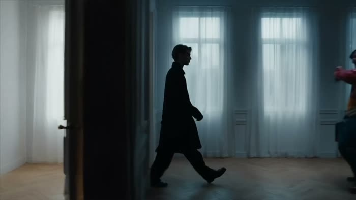
</a>

**[用 Seedance 2.5 API 生成同款 →](https://docs.hiapi.ai/zh/models/video/seedance-2-5/?utm_source=github&utm_medium=case&utm_campaign=awesome-seedance-2-5-prompts)**

</div>

#### 📌 参数

- **适用能力:** 图生视频 · 30 秒
- **画幅:** 16:9

---

### No. 5: 能量弓视频编辑


#### 📖 案例说明

保持参考视频人物、环境、镜头、动作和时长，仅加入蓝白色能量弓箭效果。

#### 📝 提示词

```
保持<<<video_1_1>>>中的人物、丛林环境、镜头运动、构图、动作节奏和时长不变。
人物手中缓缓出现蓝白色能量弓与一支发光箭矢<<<image_1_2>>>，弓身由微弱电弧和粒子逐渐聚合成形，带细腻流动的电流纹理、轻微体积光和稳定的能量轮廓。拉弓过程中，箭矢在弓弦中央凝聚成高亮能量箭，人物松手瞬间，箭矢高速射出，留下一道明亮细长、连续锐利的能量轨迹
```

#### 🎬 视频

<div align="center">

<a href="https://docs.hiapi.ai/zh/models/video/seedance-2-5/?utm_source=github&utm_medium=case&utm_campaign=awesome-seedance-2-5-prompts">
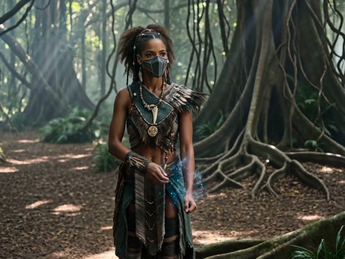
</a>

**[用 Seedance 2.5 API 生成同款 →](https://docs.hiapi.ai/zh/models/video/seedance-2-5/?utm_source=github&utm_medium=case&utm_campaign=awesome-seedance-2-5-prompts)**

</div>

#### 📌 参数

- **适用能力:** 视频编辑
- **画幅:** 16:9

---

### No. 6: FPV 多语种你好


#### 📖 案例说明

FPV 无人机一镜到底穿越自然与城市场景，依次形成 11 种语言问候。

#### 📝 提示词

```
一镜到底 FPV 无人机第一视角视频，33 秒连续长镜头，无剪辑、无跳切、无转场。镜头从高空云端内部开始，沿云层、雾气、光影、山谷、瀑布、湖面、花田、城市建筑与近地广场形成一条连续下降飞行动线。全程依次出现 11 个清晰独立的语言展示区块，每个区块只显示对应单一语言文字，不混排、不叠加、不新增其他语言。
0–3 秒，<<<image_1_1>>>云团自然形成中文 “你好”；
3–6 秒，<<<image_2_2>>>薄雾和体积光形成英语 “Hello”；
6–9 秒，<<<image_3_3>>>高空水汽与阳光投影形成西班牙语（墨西哥）“Hola”；
9–12 秒，<<<image_4_4>>>空中丝带形成印度尼西亚语 “Halo”；
12–15 秒，<<<image_5_5>>>风筝编队形成马来语 “Hai”；
15–18 秒，<<<image_6_6>>>山谷晨雾形成泰语 “สวัสดี”；
18–21 秒，<<<image_7_7>>>瀑布水雾形成阿拉伯语مرحبا
21-24 秒，<<<image_8_8>>>湖面倒影和水波光纹形成葡萄牙语“Olá”；
24–27 秒，<<<image_9_9>>>花田与草地自然排列成越南语 “Xin chào”；
27–30 秒，<<<image_10_10>>>城市玻璃建筑反射光影形成日语 “こんにちは”；
30–33 秒，<<<image_11_11>>>近地广场喷泉水雾、地面铺装和灯带形成韩语 “안녕하세요”。
整体为清晨日出氛围，金色逆光、柔和体积光、真实云雾、自然运动模糊、电影级真实感。镜头速度从 3–5 m/s 慢速启动，逐渐加速到 14–16 m/s 穿越自然景观，再减速到 2–3 m/s 于近地广场稳定悬停。镜头参数：广角镜头，24fps，平滑 FPV drone movement，pitch 从 -5° 逐步过渡到 -18°，最后回到 0°；轻微 yaw ±10°，roll 控制在 0–10°，保证连续、稳定、真实的一镜到底飞行感。
```

#### 🎬 视频

<div align="center">

<a href="https://docs.hiapi.ai/zh/models/video/seedance-2-5/?utm_source=github&utm_medium=case&utm_campaign=awesome-seedance-2-5-prompts">

</a>

**[用 Seedance 2.5 API 生成同款 →](https://docs.hiapi.ai/zh/models/video/seedance-2-5/?utm_source=github&utm_medium=case&utm_campaign=awesome-seedance-2-5-prompts)**

</div>

#### 📌 参数

- **适用能力:** 图生视频 · 33 秒
- **画幅:** 16:9

---

### No. 7: 多语种创造文字循环


#### 📖 案例说明

以多语种“创造”为主线，连续切换欧普、蜡笔、街机、蜡染、金箔、翻页、羽毛、水墨、玻璃和液态金属等风格。

#### 📝 提示词

```
一段15秒无缝循环的创意文字动画视频，4K，30fps。每种语言约1.2秒，转场通过文字溶解、变形或粒子飘散实现，无硬切。背景音乐节奏感明显，强卡点
0-1.2s 中文「创造」· 欧普视错觉纯黑背景，黑白同心圆从中心向外扩散形成视觉隧道。白色立体汉字"创造"从圆心深处缓慢凸出推向镜头，粗体无衬线，边缘有微妙阴影。同心圆随文字推进产生波纹扭曲，如水面涟漪。文字完全凸出后停顿，随即溶解为蓝色蜡笔颗粒飘散。
1.2-2.4s 英语「CREATE」· 手绘蜡笔暖黄色牛皮纸纹理背景，粗糙的蓝色蜡笔笔触逐笔写出大写英文"CREATE"。笔触带有明显的蜡笔颗粒感和重叠痕迹，E的最后一横略微上扬。写完后字母表面有轻微蜡质光泽，背景浮现淡淡的铅笔辅助线。文字随后被吸入CRT扫描线中消失。
2.4-3.6s 西班牙语「CREAR」· 复古街机深色街机框体，中央CRT屏幕有细微扫描线和荧光粉颗粒感。蓝紫渐变的立体像素字"CREAR"从底部升起，字母表面有海浪般的白色波纹动画，边缘发出霓虹蓝光。屏幕左上角有"CREDIT 00"，右下角闪烁"INSERT COIN"。文字随后像素化崩解为靛蓝色蜡染纹样。
3.6-4.8s 印尼语「CIPTAKAN」· 蜡染布料深靛蓝色传统印尼蜡染布料背景，布面有精细的抛物线花纹。白色衬线字体"CIPTAKAN"从布料下方缓缓浮起，如烫金压印，布料随文字浮现产生真实的褶皱波动。文字显现后，布料被风吹起，金色碎屑向四周飘散，转为伊斯兰几何图案。
4.8-6.0s 马来语「CIPTA」· 伊斯兰几何。深绿色丝绒背景，金色阿拉伯式几何花纹从四角向中心蔓延。白色古典衬线字"CIPTA"从中心旋转浮现，字母周围有星形图案环绕，金粉粒子飘落。文字随后被金色雕刻刀逐字刻入黑色金属牌匾。
6.0-7.2s 泰语「สร้างสรรค์」· 金箔雕刻黑色背景，泰文"สร้างสรรค์"以金色呈现，仿佛从古老寺庙牌匾上被雕刻出来。文字表面有细微的金箔剥落动画，露出下方暗红色底漆，金色碎屑向四周飘散。雕刻完成后，文字熔化为银色汞液滴落。
7.2-8.4s 阿拉伯语「إبداع」· 机械翻页。黑色金属翻页显示屏占据整个画面，机械叶片咔嗒作响依次翻转。白色像素格组成的阿拉伯文"إبداع"从右至左逐字显现，每个字母翻转伴随精确的机械运动和轻微震动。翻页完成后，文字被彩色桑巴羽毛风暴席卷。
8.4-9.6s 葡萄牙语「CRIAR」· 狂欢羽毛。黑色背景，彩色桑巴羽毛从画面边缘向中心汇聚形成巨大羽毛扇。白色粗体字"CRIAR"从羽毛扇中心爆裂而出，羽毛随文字冲击向四周飞散，文字表面有Carnival亮片反光，巴西国旗绿黄蓝光斑闪烁。文字随后被黑色水墨冲刷。
9.6-10.8s 越南语「SÁNG TẠO」· 水墨丝绸。米白色丝绸背景，黑色水墨从画面顶部缓缓流淌，逐渐形成越南语"SÁNG TẠO"。水墨在丝绸上产生自然的晕染边缘，部分墨滴向下滴落形成悬挂的墨珠。完成后丝绸被风吹起，露出下方莲花暗纹，文字凝结为透明玻璃球。
10.8-12.0s 日语「創造」· 光学玻璃纯黑背景中央悬浮一颗完美的透明光学玻璃球，球体折射出彩虹色散光斑。玻璃球后方，日文汉字"創造"以彩虹色散投影呈现，随玻璃球缓慢旋转，文字产生扭曲拉伸分离的光学畸变。玻璃球表面有细微灰尘颗粒，随后球体熔化为银色液态金属。
12.0-13.2s 韩语「창조」· 液态金属。深邃星空背景，银色液态汞从画面顶部滴落，在空中自然凝聚成韩文"창조"。液态字表面有强烈的镜面反射，倒映周围星辰。文字形成后，部分汞液继续向下滴落，形成悬挂的金属珠，最终所有金属液汇聚成一颗巨大的银色球体。
```

#### 🎬 视频

<div align="center">

<a href="https://docs.hiapi.ai/zh/models/video/seedance-2-5/?utm_source=github&utm_medium=case&utm_campaign=awesome-seedance-2-5-prompts">
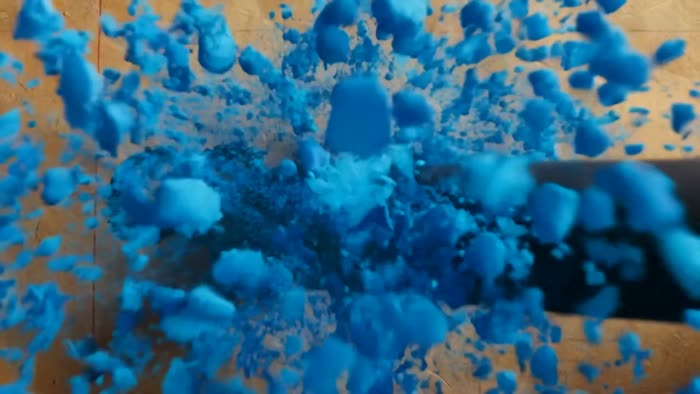
</a>

**[用 Seedance 2.5 API 生成同款 →](https://docs.hiapi.ai/zh/models/video/seedance-2-5/?utm_source=github&utm_medium=case&utm_campaign=awesome-seedance-2-5-prompts)**

</div>

#### 📌 参数

- **适用能力:** 文生视频 · 15 秒
- **画幅:** 16:9

---

### No. 8: 高定光斑视觉大片


#### 📖 案例说明

高定品牌级视觉短片，结合微距光斑、钢琴、花径奔跑、喷泉阅读、泡泡折射和材质细节。

#### 📝 提示词

```
【整体风格设定】
一段极具电影感与高级质感的30秒高定品牌级视觉大片。画面强调梦幻光斑（Bokeh）、丝滑的动感模糊转场（Motion blur）、体积光（Volumetric lighting）以及超写实的材质细节表现力。
【分镜描述】
[0-5秒]：梦幻序章与微距特写
极高画质的微距特写。一只纤细的手伸向空中，指尖触碰着如星辰般璀璨、闪烁的彩色光斑。伴随光影流转，无缝丝滑转场至一位穿着纯白薄纱裙的优雅女性，她正沉醉地弹奏一架复古钢琴。浅景深，背景虚化为唯美的蓝绿色调。
[5-15秒]：随后切入流畅的跟随运镜（Follow shot）：一名戴着法式宽檐草帽、身披飘逸白裙的女子，在开满粉橘色玫瑰与蓝色绣球花的繁密花径中轻盈奔跑。光线透过树叶洒下斑驳光影，完美展现柔和的微风、真实的裙摆布料飘动物理演算以及花瓣的超写实纹理。
[15-24秒]：静谧美学与光影折射
镜头节奏放缓，进入极致唯美的慢动作（Slow-motion）。一位少女坐在欧式复古流金喷泉旁的黑色铁艺桌前静静阅读。空气中漂浮着漫天晶莹剔透的肥皂泡泡，泡泡表面完美折射出周围的繁花与温暖的阳光。水滴溅落的瞬间清晰可见，展现模型对透明材质、水体折射与复杂光照的顶级渲染能力。
```

#### 🎬 视频

<div align="center">

<a href="https://docs.hiapi.ai/zh/models/video/seedance-2-5/?utm_source=github&utm_medium=case&utm_campaign=awesome-seedance-2-5-prompts">

</a>

**[用 Seedance 2.5 API 生成同款 →](https://docs.hiapi.ai/zh/models/video/seedance-2-5/?utm_source=github&utm_medium=case&utm_campaign=awesome-seedance-2-5-prompts)**

</div>

#### 📌 参数

- **适用能力:** 文生视频 · 30 秒
- **画幅:** 3:4

---

### No. 9: 深海水母 Seedance


#### 📖 案例说明

蓝色珊瑚礁中加入发光水母群和上浮气泡，并让气泡形成 Seedance 字样。

#### 📝 提示词

```
深海珊瑚礁场景，蓝色主调的热带海底世界，大面积健康繁盛的彩色活珊瑚，包含枝状珊瑚、脑珊瑚、盘状珊瑚和柔软海扇珊瑚，大量热带鱼群自然穿梭其中，近景清晰鲜活，远景逐渐偏蓝偏灰、对比减弱，上方自然光经过海水过滤形成柔和体积光，海水中有细小悬浮颗粒和轻微流动感，软珊瑚轻轻摆动，鱼群运动平滑协调，添加一群半透明的淡紫色发光水母缓缓出现，共 8-12 只，大小各异。伞状体带有柔和的生物荧光效果，触须随波轻柔飘动，触须末端有微弱的紫色光点。水母大小与珊瑚和鱼类比例协调，发光效果柔和不刺眼，在深色海水背景中形成梦幻的光斑。水母群的运动轨迹自然，呈缓慢上升螺旋状，部分水母从镜头前方游过产生轻微的镜头光晕效果。保持水下的蓝色调光照，水母的发光与周围珊瑚的微弱反光和谐共存。 水母群游动过程中产生了气泡，气泡上浮，在海中形成了“Seedance”字样
```

#### 🎬 视频

<div align="center">

<a href="https://docs.hiapi.ai/zh/models/video/seedance-2-5/?utm_source=github&utm_medium=case&utm_campaign=awesome-seedance-2-5-prompts">
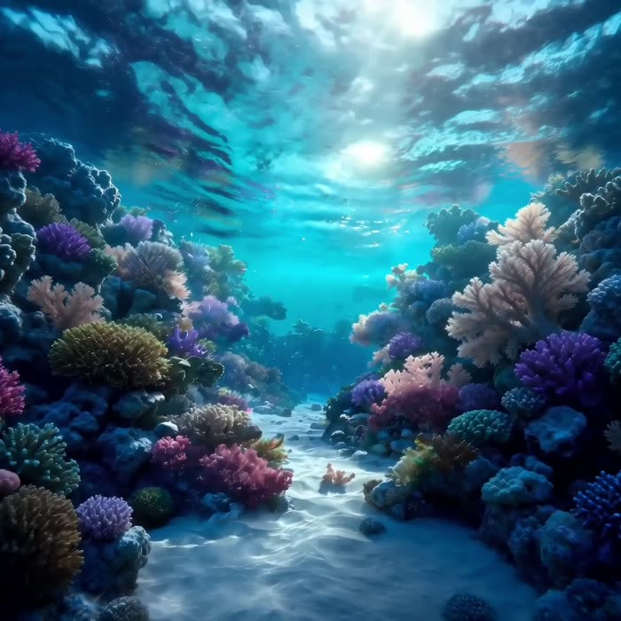
</a>

**[用 Seedance 2.5 API 生成同款 →](https://docs.hiapi.ai/zh/models/video/seedance-2-5/?utm_source=github&utm_medium=case&utm_campaign=awesome-seedance-2-5-prompts)**

</div>

#### 📌 参数

- **适用能力:** 文生视频
- **画幅:** 1:1

---

### No. 10: 漂浮沙漠美术馆


#### 📖 案例说明

清晨金色沙漠里，极简白色美术馆漂浮于沙丘上方，镜头推进进入内部再打开至天空。

#### 📝 提示词

```
电影质感，高级感，清晨金色沙漠，一座极简主义白色美术馆建筑漂浮在沙丘上方，建筑表面有细腻石材纹理和柔和反射。阳光穿过沙尘形成体积光，远处沙丘层次分明。镜头从超广角沙漠全景开始，缓慢向前推进，穿过飞扬的沙粒，进入漂浮建筑内部。室内有悬浮雕塑、半透明丝绸装置和一位身穿白色长袍的角色，布料随风自然摆动。镜头围绕角色进行平滑环绕运动，最后建筑墙面缓慢打开，露出巨大的天空和沙漠。高端艺术广告风格，真实光照，精致材质，电影级构图，优雅运动，超现实但真实可信。
```

#### 🎬 视频

<div align="center">

<a href="https://docs.hiapi.ai/zh/models/video/seedance-2-5/?utm_source=github&utm_medium=case&utm_campaign=awesome-seedance-2-5-prompts">
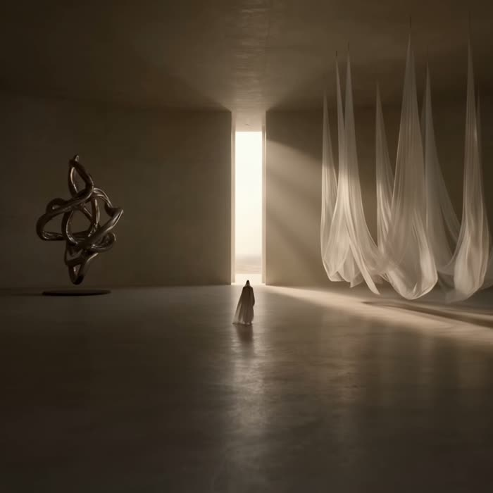
</a>

**[用 Seedance 2.5 API 生成同款 →](https://docs.hiapi.ai/zh/models/video/seedance-2-5/?utm_source=github&utm_medium=case&utm_campaign=awesome-seedance-2-5-prompts)**

</div>

#### 📌 参数

- **适用能力:** 文生视频
- **画幅:** 1:1

---

### No. 11: 荒漠高级品牌概念片


#### 📖 案例说明

30 秒荒漠高端品牌大片，包含颠倒视角、风沙时装特写、虚拟影棚揭示和月光质感收束。

#### 📝 提示词

```
一部极具视觉张力的30秒高级品牌概念短片。开场采用超现实的颠倒视角，镜头随重力翻转，展现模特穿着复古麂皮靴的双脚轻踏在起伏的赤色沙丘上，微距镜头特写靴子表面的磨砂绒感与沾染的粗糙红沙颗粒。随后切入一系列充满失重感与梦幻色彩的蒙太奇：年轻的男女模特在暗流涌动的琥珀色风沙与冷冽的边缘轮廓光中轻盈向后坠落；镜头迅速切入面部的极锐利特写——风沙吹拂过沾着微小金沙的睫毛，模特佩戴着复古金属框架墨镜，弧形镜片中清晰地反射出荒野的烈日与风暴。随后，佩戴着做旧厚重银戒的手指，轻柔拂过粗粝沧桑的岩壁与随风狂舞的芦苇丛。
画面大量运用极具表现力的镜头语言：通过极低视角的微距镜头，透过边缘虚化且剔透的天然矿石晶体仰拍深邃的浩瀚星空与肆意穿行的探险者。在宏大场景中密集穿插高质感的局部特写：风中猎猎作响的粗纺亚麻衬衫纹理、模特紧绷冷峻的下颌线，以及颈部肌肤在逆光下闪烁的汗水光泽。结合鱼眼镜头、快速的旋转运镜与丝滑的视觉错位转场，营造出前卫且充满野性张力的神秘动感。
短片高潮处，镜头极具戏剧性地拉远，打破‘第四面墙’，揭示这其实是一个搭建了巨型LED星轨环形天幕与真实红沙阵列的高级虚拟影棚，将旷野的苍茫感与先锋的工业片场感完美碰撞。结尾处节奏放缓，回归细腻的质感特写：一位披发女子倚靠在复古越野车旁，镜头缓缓扫过车身斑驳剥落的重金属烤漆，女子随性地让掌心的细沙从指缝间滑落。清冷而皎洁的月光（Moonlight）侧光精准勾勒出做旧皮革外套粗犷的面料毛孔、重金属拉链折射的冷光，以及女子冷峻立体的面部轮廓。整体呈现复古胶片级的色彩美学，深邃的幽夜蓝与炽热的矿石橘交织，画面大气、自由，充满极高质感的品牌张力。最后画面中央优雅浮现“seedance”文字。
```

#### 🎬 视频

<div align="center">

<a href="https://docs.hiapi.ai/zh/models/video/seedance-2-5/?utm_source=github&utm_medium=case&utm_campaign=awesome-seedance-2-5-prompts">
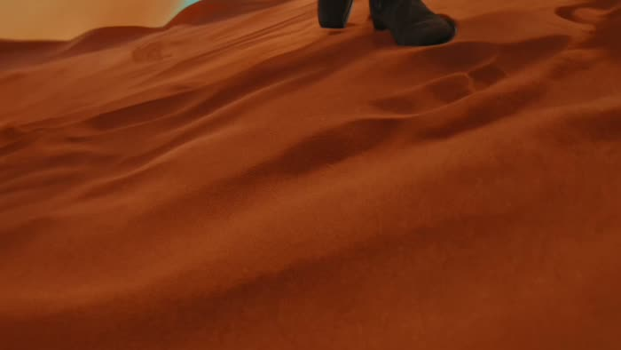
</a>

**[用 Seedance 2.5 API 生成同款 →](https://docs.hiapi.ai/zh/models/video/seedance-2-5/?utm_source=github&utm_medium=case&utm_campaign=awesome-seedance-2-5-prompts)**

</div>

#### 📌 参数

- **适用能力:** 文生视频 · 30 秒
- **画幅:** 16:9

---

### No. 12: 京剧非遗传承短片


#### 📖 案例说明

温暖克制的京剧非遗短片，围绕老师傅、学徒、手作细节、戏服整理和传承情感展开。

#### 📝 提示词

```
京剧非遗短片，电影感，东方美学，温暖克制。传统戏班后台与手工作坊里，老师傅安静制作京剧头饰、整理戏服、勾勒脸谱，手部细节细腻，丝线、珠饰、颜料和绣纹都很有质感。一个年轻学徒在旁边认真看着，随后小心接过工具，在老师傅指导下完成细小步骤。老师傅为他扶正头面、整理衣襟，像把一门手艺和一份情感轻轻交到他手里。最后年轻人穿戴整齐，站在即将上场的戏台边，微光照亮戏服与侧脸，老师傅在身后安静注视。整体氛围安静、深情、有传承感，少字幕，穿插合适的台词。
```

#### 🎬 视频

<div align="center">

<a href="https://docs.hiapi.ai/zh/models/video/seedance-2-5/?utm_source=github&utm_medium=case&utm_campaign=awesome-seedance-2-5-prompts">
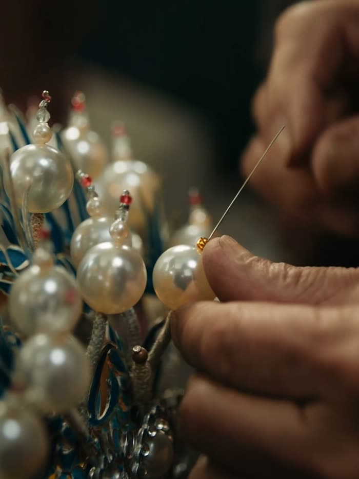
</a>

**[用 Seedance 2.5 API 生成同款 →](https://docs.hiapi.ai/zh/models/video/seedance-2-5/?utm_source=github&utm_medium=case&utm_campaign=awesome-seedance-2-5-prompts)**

</div>

#### 📌 参数

- **适用能力:** 文生视频
- **画幅:** 3:4

---

### No. 13: 海洋文明剧场


#### 📖 案例说明

史诗科幻海洋文明，从深海遗迹、雕塑生命体、文明苏醒、神殿船升起到太空尺度收束。

#### 📝 提示词

```
落剧场（Oceanic Civilization）》
（史诗科幻 / Dune × Interstellar / 无真人 / 雕塑生命体）
【0–5秒｜宇宙级开场 · 海洋作为星球记忆】
深蓝色海洋占据画面全景，极深层水体呈现分层结构，如同星球内部的液态宇宙。
镜头从高空缓慢垂直下坠，穿过云层与海雾，进入海面。
海面像金属薄膜般波动，折射出不规则的太阳光裂缝，极具史诗感体积光。
【5–10秒｜进入深海文明断层】
镜头穿透海面，进入深海。
巨大的“海底文明结构”逐渐显现：
断裂的环形巨构建筑、沉没的石质穹顶、漂浮的几何遗迹平台。
结构风格融合古代神殿 + 外星文明科技感（类似 Dune 遗迹语言）。
海水中悬浮着微光颗粒，如星尘在水中缓慢漂移。
【10–15秒｜雕塑生命体出现（非人类）】
在剧场中央，矗立着巨型雕塑生命体：
由白色石材与半透明矿物构成的“人形神像”，但无生命细节（无皮肤、无真实人类特征）。
其姿态如古代仪式结构，身体呈分段几何结构，类似文明记忆载体。
雕塑表面被水流长期侵蚀，布满海藻与珊瑚晶化结构。
镜头缓慢环绕雕塑，形成“神祇降临感”。
【15–20秒｜文明被唤醒 · 光流激活】
整个海底遗迹开始“苏醒”。
雕塑内部出现微弱能量流动光纹，如神经网络般点亮。
断裂石柱缓慢上升重组，形成环形剧场结构。
水体开始出现“秩序性流动”，仿佛空间被重新计算。
镜头由静态环绕 → 轻微加速旋转。
【20–24秒｜海面反转 · 上升突破】
镜头突然向上加速冲出海面。
海水被撕开般向两侧分离，形成巨型水幕。
一艘古代文明巨型飞船/神殿船体从海底升起：
外形像融合石质神殿与科幻舰船的混合体，表面覆盖珊瑚与矿化结构。
船体带着海水瀑布般上升。
【24–27秒｜史诗旋转镜头（视觉高潮）】
镜头围绕巨船高速旋转上升（spiral orbit shot）。
太阳从云层裂隙中穿透，形成神圣光柱。
水流被旋转拉成螺旋形态，如星系结构。
船体缓慢翻转，展现其庞大结构：
类似“移动文明遗迹”而非交通工具。
【27–30秒｜终极远景 · 文明尺度揭示】
镜头极速拉远至太空级视角。
海洋、遗迹、升起的巨船、雕塑神殿在同一画面垂直排列：
形成“海底文明—海面—天空光层”的三段宇宙结构。
整个世界像一个被唤醒的古代星球记忆系统。
最终画面缓慢收束进入黑屏，仅剩微弱光点残留。
史诗科幻美学 / Dune风沙海文明结构感 / Interstellar级空间尺度 / 无人物叙事 / 雕塑文明遗迹 / 外星神殿结构 / 体积光穿透海水 / 巨构建筑崩塌与重组 / 神圣仪式感镜头 / 螺旋运镜 / 星尘粒子海洋 / 高动态范围电影级真实感
```

#### 🎬 视频

<div align="center">

<a href="https://docs.hiapi.ai/zh/models/video/seedance-2-5/?utm_source=github&utm_medium=case&utm_campaign=awesome-seedance-2-5-prompts">
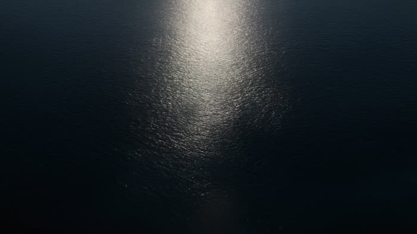
</a>

**[用 Seedance 2.5 API 生成同款 →](https://docs.hiapi.ai/zh/models/video/seedance-2-5/?utm_source=github&utm_medium=case&utm_campaign=awesome-seedance-2-5-prompts)**

</div>

#### 📌 参数

- **适用能力:** 文生视频 · 30 秒
- **画幅:** 16:9

---

### No. 14: 机械花开


#### 📖 案例说明

一镜到底微距推进，从黑暗金属花苞进入精密机械花瓣，最终机械花绽放并向外扩光。

#### 📝 提示词

```
主题是“机械花开”。画面需要突出生成视频模型在光影、美术细节、真实感、镜头运动和角色电影感方面的优势。整体风格为高端科技品牌广告，具有强视觉冲击力。视频采用一镜到底的微距推进镜头，从黑暗中的金属花苞开始，逐渐进入花瓣内部的精密机械结构，最后以机械花完全绽放、光线向外扩散作为高潮画面。要求真实物理光照、精致金属和玻璃材质、细腻机械运动、稳定构图、电影级调色、无字幕
```

#### 🎬 视频

<div align="center">

<a href="https://docs.hiapi.ai/zh/models/video/seedance-2-5/?utm_source=github&utm_medium=case&utm_campaign=awesome-seedance-2-5-prompts">
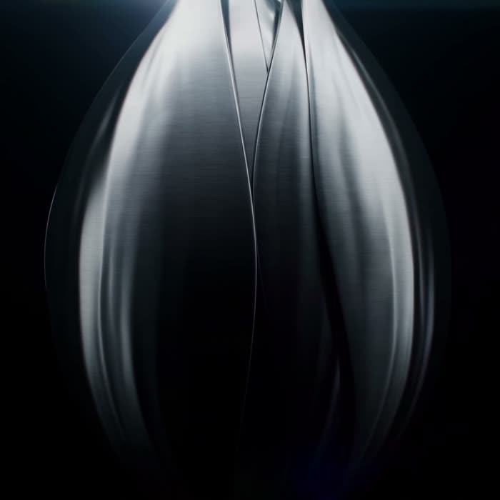
</a>

**[用 Seedance 2.5 API 生成同款 →](https://docs.hiapi.ai/zh/models/video/seedance-2-5/?utm_source=github&utm_medium=case&utm_campaign=awesome-seedance-2-5-prompts)**

</div>

#### 📌 参数

- **适用能力:** 文生视频
- **画幅:** 1:1

---

### No. 15: 丝路石榴岩彩动画


#### 📖 案例说明

岩彩平面动画，讲述石榴从枝头、丝路古道、现代案台到榨成果汁和海报式收束的旅程。

#### 📝 提示词

```
整体风格要求：岩彩平面动画，东方与丝路装饰美学，矿物颜料质感，朱砂红、赭石、石绿、群青、金色点缀，纸本与壁画肌理，平面分层，不要真实摄影，不要 3D 写实。画面节奏由静到动，再由动回归沉静，突出 “从土地到杯中” 的旅程感与丰盛感，音乐欢快，西域风格。
镜头一：枝头初现，丰盛开场（0-4 秒）
丝路画作纸面上晕开赭石与朱红色块，一株石榴枝条从画面右侧舒展出来，叶片厚重，带有明显矿物颜料层次。枝头一颗饱满石榴缓缓显现，外壳红中带金，轮廓圆润安静。阳光以金色圆斑和金箔碎点落在果皮上，石榴表面泛出温润光泽，像一枚被时光养熟的果实，开场气质丰盛而克制。
镜头二：轻轻摘下，旅程开始（4-7 秒）
石榴被一位西域侍女轻轻摘下，动作平稳优雅。背景逐渐浮现卷草纹、古老纹样和装饰性长卷构图，暗示它来自久远土地。画面从静态枝头自然过渡到旅程展开，山岭、道路与城镇开始在背景中平面铺陈，像一幅丝路长卷慢慢被打开。
镜头三：穿越古道，跨越山河（7-13 秒）
驼队剪影缓慢前行，铃铛以细小金点表现节奏，石榴出现在骆驼的背包里。古道穿过沙丘、绿洲与城门，风沙以流动纹样掠过，金线勾出的道路不断向远方延展。色彩浓烈而高级，像丝路壁画与岩彩插画融合在一起。石榴在漫长路途中始终鲜艳饱满，像把遥远土地的阳光、热度与丰盛一直保存到了今天。
镜头四：古今转场，抵达当下（13-16 秒）
背景中的古代纹样与建筑轮廓逐渐简化，时间悄悄过渡到现代空间。石榴被放在现代案台上，桌面与器皿以简洁平面几何呈现，古今视觉在同一画面中完成连接，画面节奏从 “远行” 转为 “抵达”。
镜头五：切开石榴，视觉高潮（16-20 秒）
一只手轻轻切开石榴，动作缓慢克制，果皮裂开的一瞬间极具仪式感。
镜头六：榨成果汁，丰沛流动（20-24 秒）
籽粒进入器皿，被压榨成浓郁石榴汁，液体流动呈深红通透质感，带细腻岩彩颗粒。石榴汁被缓缓倒入现代玻璃杯中，玻璃轮廓清晰简洁，红色液体在杯中升高，表面泛起微微波纹与高光。几颗冰块落入杯中，冷白色与深红色形成鲜明对比，杯壁出现细密水珠，清爽感被拉满。
镜头七：现代饮用，旅程落地（24-27 秒）
背景切入现代生活场景，窗光、桌面、织物与植物保持平面装饰性和温润配色。果汁杯置于画面中央，周围隐约叠加古道、驼队、城门纹样，暗示这杯果汁来自漫长旅程。氛围丰盛、温暖、沉静。
镜头八：时间汇合，海报式收束（27-30 秒）
背景中的古道纹样与现代空间逐渐融合，像时间在这一杯果汁里汇合。画面短暂回闪枝头石榴、古道驼影和红色籽粒，形成 “从土地到杯中” 的完整回路。最后收束成广告海报式构图：深红浓艳的石榴汁置于中央，杯旁是一颗裂开的石榴，周围叠加古道纹样、金色光点与现代生活元素，画面安静却充满生命力，像一段跨越时间与土地的旅程终于抵达当下，广告词“seedance，来自西域的礼物”。
```

#### 🎬 视频

<div align="center">

<a href="https://docs.hiapi.ai/zh/models/video/seedance-2-5/?utm_source=github&utm_medium=case&utm_campaign=awesome-seedance-2-5-prompts">
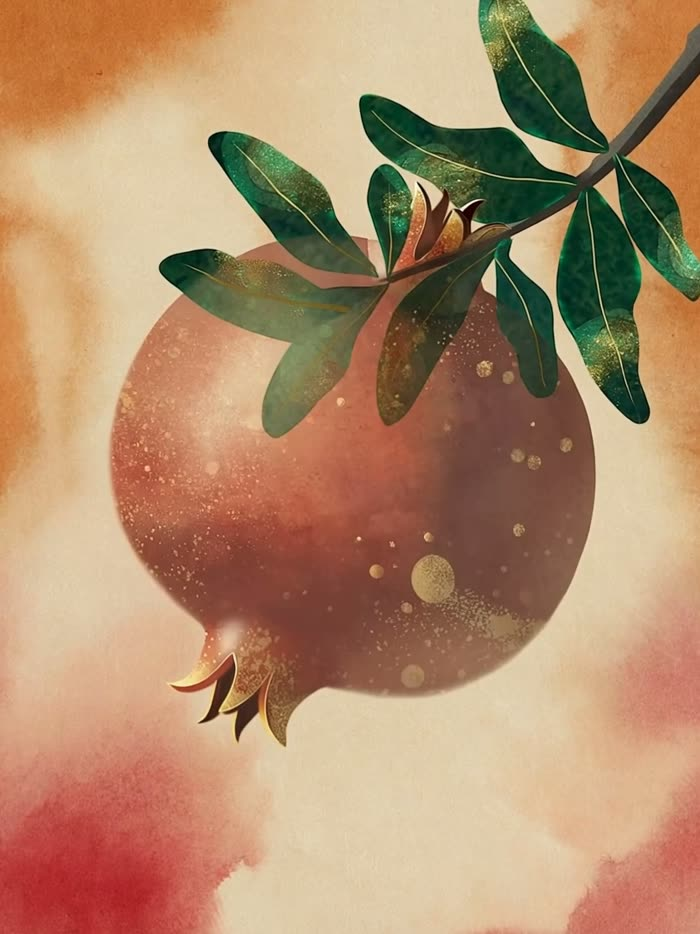
</a>

**[用 Seedance 2.5 API 生成同款 →](https://docs.hiapi.ai/zh/models/video/seedance-2-5/?utm_source=github&utm_medium=case&utm_campaign=awesome-seedance-2-5-prompts)**

</div>

#### 📌 参数

- **适用能力:** 文生视频 · 30 秒
- **画幅:** 3:4

---


<a id="run"></a>
## 🚀 用 API 运行提示词

复制上面任意一条提示词,发送到 HiAPI 统一任务接口:

```bash
curl -X POST "https://api.hiapi.ai/v1/tasks" \
  -H "Authorization: Bearer $HIAPI_API_KEY" \
  -H "Content-Type: application/json" \
  -d '{
    "model": "seedance-2.5",
    "input": {
      "prompt": "粘贴本页任意提示词",
      "duration": 30,
      "resolution": "1080p",
      "aspect_ratio": "16:9"
    }
  }'
```

Python:

```bash
pip install hiapi-seedance
```

```python
from hiapi_seedance import Seedance

client = Seedance()
task = client.text_to_video(
    prompt="粘贴本页任意提示词",
    duration=30,
    aspect_ratio="16:9",
)
print(task.output[0].url)
```

AI Agent 工作流:

```bash
npx -y github:HiAPIAI/hiapi-seedance-2-0-video-skill -y
```

**链接:** [Seedance 2.5 API 文档](https://docs.hiapi.ai/zh/models/video/seedance-2-5/?utm_source=github&utm_medium=readme&utm_campaign=awesome-seedance-2-5-prompts) · [获取 API Key](https://www.hiapi.ai/zh/register?utm_source=github&utm_medium=readme&utm_campaign=awesome-seedance-2-5-prompts) · [定价](https://www.hiapi.ai/zh/pricing?utm_source=github&utm_medium=readme&utm_campaign=awesome-seedance-2-5-prompts) · [Seedance Python SDK](https://github.com/HiAPIAI/hiapi-seedance-python) · [Seedance 2.0 提示词库](https://github.com/HiAPIAI/awesome-seedance-2-0-prompts)

---

<a id="contribute"></a>
## 🤝 参与贡献

欢迎通过 [issue](https://github.com/HiAPIAI/awesome-seedance-2-5-prompts/issues) 或 PR 提交新提示词、改进或勘误,质量标准见 [CONTRIBUTING.md](./CONTRIBUTING.md)。

---

<a id="license"></a>
## 📄 许可

以 [CC BY 4.0](LICENSE) 发布,第三方素材说明见 [NOTICE.md](NOTICE.md)。Seedance 是字节跳动的模型;本仓库为独立提示词库。
