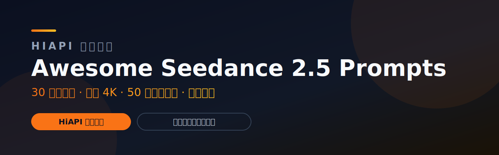

<div align="center">

<a href="https://www.hiapi.ai/zh?utm_source=github&utm_medium=readme&utm_campaign=awesome-seedance-2-5-prompts"></a>

[](https://www.hiapi.ai/zh?utm_source=github&utm_medium=readme&utm_campaign=awesome-seedance-2-5-prompts) [](https://www.hiapi.ai/zh/register?utm_source=github&utm_medium=readme&utm_campaign=awesome-seedance-2-5-prompts) [](https://www.hiapi.ai/zh/models?utm_source=github&utm_medium=readme&utm_campaign=awesome-seedance-2-5-prompts) [](https://docs.hiapi.ai/?utm_source=github&utm_medium=readme&utm_campaign=awesome-seedance-2-5-prompts)

   

# Awesome Seedance 2.5 Prompts

**面向创作者、开发者和 AI Agent 的双语 Seedance 2.5 提示词库。**

[用 HiAPI 运行](https://www.hiapi.ai/zh/register?utm_source=github&utm_medium=readme&utm_campaign=awesome-seedance-2-5-prompts) · [Seedance Python SDK](https://github.com/HiAPIAI/hiapi-seedance-python) · [结构化数据](./data/official-cases.json) · [English](README.md) · [Seedance 2.0 提示词库](https://github.com/HiAPIAI/awesome-seedance-2-0-prompts) · [视频生成 Skill](https://github.com/HiAPIAI/hiapi-seedance-2-0-video-skill)

*Seedance 2.5 提示词 · AI 视频提示词 · 文生视频提示词 · 图生视频提示词 · 30 秒视频提示词 · HiAPI 视频 API*

</div>

> **HiAPI Matrix:** [Image Prompts](https://github.com/HiAPIAI/awesome-gpt-image-2-prompts) · [Seedance 2.0 Prompts](https://github.com/HiAPIAI/awesome-seedance-2-0-prompts) · **Seedance 2.5 Prompts** · [Seedance Python SDK](https://github.com/HiAPIAI/hiapi-seedance-python) · [Agent Skills](https://github.com/HiAPIAI/hiapi-skills) · [Remote MCP](https://docs.hiapi.ai/zh/for-ai/) · [API Docs](https://docs.hiapi.ai)

## 这是什么

Seedance 2.5 改变的是视频提示词的写法。短视频提示词可以只描述一个镜头；Seedance 2.5 更适合写成一场完整的戏：有连续性、有参考素材、有文字呈现、有可控编辑、有音乐节奏，也有明确的画面收束。

这个仓库把这些写法整理成一个可搜索、可复用、可接 HiAPI 的提示词库。

你会得到：

- **15 个 Seedance 2.5 视频案例索引**：包含直连 MP4、画幅、参考素材、标签和提示词主题。
- **10 个 HiAPI 原创首发模板**：在 [`data/templates.json`](./data/templates.json)，覆盖产品片、对话戏、运动镜头、ASMR、建筑漫游、音乐演出和时间流逝等方向。
- **中英文 SEO 页面**：方便搜索 Seedance 2.5 提示词、AI 视频提示词、文生视频 prompt、图生视频参考、30 秒视频 prompt。
- **HiAPI 调用入口**：当 Seedance 2.5 在 HiAPI 可用时，可以直接把提示词接入统一视频 API。

> 第三方来源页的长 prompt 原文不在本仓库全文转载。本仓库做案例索引、结构化数据和写法拆解；需要逐字复制原始 prompt 时，请打开来源页查看。完整来源和权利说明见 [NOTICE.md](./NOTICE.md)。

## 案例库

点击任意预览图即可打开 MP4 播放。视频仍在来源 CDN 上，本仓库不重新托管视频文件。

| 预览 | 案例 |
|---|---|
| [](https://ark-common-storage-prod-cn-beijing.tos-cn-beijing.volces.com/presets/experience/gen_video/model-promotion/seedance-2-5/firstScreen/group1/1.mp4) | **1. 水晶球卡点转场短片**<br>水晶球主体固定清晰，背景随电子节拍高速无缝切换。<br><sub>text-to-video · 16:9</sub> |
| [](https://ark-common-storage-prod-cn-beijing.tos-cn-beijing.volces.com/presets/experience/gen_video/model-promotion/seedance-2-5/firstScreen/group3/output.mp4) | **2. 窗景意象品牌短片**<br>以参考图串联车窗、水下、花窗、彩窗、眼睛等窗口意象。<br><sub>image-to-video · 16:9</sub> |
| [](https://ark-common-storage-prod-cn-beijing.tos-cn-beijing.volces.com/presets/experience/gen_video/model-promotion/seedance-2-5/firstScreen/group2/2.mp4) | **3. 蒸汽朋克扑翼机一镜到底**<br>30 秒连续穿梭蒸汽朋克微缩世界，包含齿轮、扑翼机、幻影箱、缆车、玻璃海浪和月光山脊。<br><sub>text-to-video · 16:9 · 30s</sub> |
| [](https://ark-common-storage-prod-cn-beijing.tos-cn-beijing.volces.com/presets/experience/gen_video/model-promotion/seedance-2-5/part1/tab1/group1/output.mp4) | **4. 六个相连房间**<br>黑衣人物匀速穿过六个结构一致但情绪、风格和事件完全不同的房间。<br><sub>image-to-video · 16:9 · 30s</sub> |
| [](https://ark-common-storage-prod-cn-beijing.tos-cn-beijing.volces.com/presets/experience/gen_video/model-promotion/seedance-2-5/part2/group1/output.mp4) | **5. 能量弓视频编辑**<br>保持参考视频人物、环境、镜头、动作和时长，仅加入蓝白色能量弓箭效果。<br><sub>video-editing · 16:9</sub> |
| [](https://ark-common-storage-prod-cn-beijing.tos-cn-beijing.volces.com/presets/experience/gen_video/model-promotion/seedance-2-5/part3/group1/output.mp4) | **6. FPV 多语种你好**<br>FPV 无人机一镜到底穿越自然与城市场景，依次形成 11 种语言问候。<br><sub>image-to-video · 16:9 · 33s</sub> |
| [](https://ark-common-storage-prod-cn-beijing.tos-cn-beijing.volces.com/presets/experience/gen_video/model-promotion/seedance-2-5/ugc/16-9/169-1.mp4) | **7. 多语种创造文字循环**<br>以多语种“创造”为主线，连续切换欧普、蜡笔、街机、蜡染、金箔、翻页、羽毛、水墨、玻璃和液态金属等风格。<br><sub>text-to-video · 16:9 · 15s</sub> |
| [](https://ark-common-storage-prod-cn-beijing.tos-cn-beijing.volces.com/presets/experience/gen_video/model-promotion/seedance-2-5/ugc/3-4/34-1.mp4) | **8. 高定光斑视觉大片**<br>高定品牌级视觉短片，结合微距光斑、钢琴、花径奔跑、喷泉阅读、泡泡折射和材质细节。<br><sub>text-to-video · 3:4 · 30s</sub> |
| [](https://ark-common-storage-prod-cn-beijing.tos-cn-beijing.volces.com/presets/experience/gen_video/model-promotion/seedance-2-5/ugc/1-1/11-1.mp4) | **9. 深海水母 Seedance**<br>蓝色珊瑚礁中加入发光水母群和上浮气泡，并让气泡形成 Seedance 字样。<br><sub>text-to-video · 1:1</sub> |
| [](https://ark-common-storage-prod-cn-beijing.tos-cn-beijing.volces.com/presets/experience/gen_video/model-promotion/seedance-2-5/ugc/1-1/11-2.mp4) | **10. 漂浮沙漠美术馆**<br>清晨金色沙漠里，极简白色美术馆漂浮于沙丘上方，镜头推进进入内部再打开至天空。<br><sub>text-to-video · 1:1</sub> |
| [](https://ark-common-storage-prod-cn-beijing.tos-cn-beijing.volces.com/presets/experience/gen_video/model-promotion/seedance-2-5/ugc/16-9/169-2.mp4) | **11. 荒漠高级品牌概念片**<br>30 秒荒漠高端品牌大片，包含颠倒视角、风沙时装特写、虚拟影棚揭示和月光质感收束。<br><sub>text-to-video · 16:9 · 30s</sub> |
| [](https://ark-common-storage-prod-cn-beijing.tos-cn-beijing.volces.com/presets/experience/gen_video/model-promotion/seedance-2-5/ugc/3-4/34-2.mp4) | **12. 京剧非遗传承短片**<br>温暖克制的京剧非遗短片，围绕老师傅、学徒、手作细节、戏服整理和传承情感展开。<br><sub>text-to-video · 3:4</sub> |
| [](https://ark-common-storage-prod-cn-beijing.tos-cn-beijing.volces.com/presets/experience/gen_video/model-promotion/seedance-2-5/ugc/16-9/169-3.mp4) | **13. 海洋文明剧场**<br>史诗科幻海洋文明，从深海遗迹、雕塑生命体、文明苏醒、神殿船升起到太空尺度收束。<br><sub>text-to-video · 16:9 · 30s</sub> |
| [](https://ark-common-storage-prod-cn-beijing.tos-cn-beijing.volces.com/presets/experience/gen_video/model-promotion/seedance-2-5/ugc/1-1/11-3.mp4) | **14. 机械花开**<br>一镜到底微距推进，从黑暗金属花苞进入精密机械花瓣，最终机械花绽放并向外扩光。<br><sub>text-to-video · 1:1</sub> |
| [](https://ark-common-storage-prod-cn-beijing.tos-cn-beijing.volces.com/presets/experience/gen_video/model-promotion/seedance-2-5/ugc/3-4/34-3.mp4) | **15. 丝路石榴岩彩动画**<br>岩彩平面动画，讲述石榴从枝头、丝路古道、现代案台到榨成果汁和海报式收束的旅程。<br><sub>text-to-video · 3:4 · 30s</sub> |

完整结构化数据在 [`data/official-cases.json`](./data/official-cases.json)：包含视频链接、预览图、参考图片/视频、标签、分类和提示词主题。

## 提示词写法

做自己的 Seedance 2.5 prompt 时，可以按这些模式来写：

| 写法 | 适合什么 | 对应案例 |
|---|---|---|
| 30 秒一镜到底 | 一个完整场景，有铺垫、转折和收束 | 蒸汽朋克扑翼机、六个相连房间 |
| 卡点转场 | 主体稳定，背景随音乐快速变化 | 水晶球卡点转场 |
| 多参考控制 | 用多张图约束人物、空间、风格和细节 | 窗景意象品牌片、六个相连房间 |
| 可控视频编辑 | 保持原视频运动和时长，只改一层视觉效果 | 能量弓视频编辑 |
| 场景内文字 | 让云雾、水波、建筑、字体或材质自然形成文字 | FPV 多语种你好、多语种创造文字循环 |
| 高级广告大片 | 时装、产品、建筑、材质特写和电影转场 | 高定光斑视觉大片、荒漠品牌片、漂浮美术馆 |
| 风格化动画 | 非写实平面美术、材质、节奏和商业收束 | 丝路石榴岩彩动画 |

## HiAPI 原创模板

仓库里还放了 10 个 HiAPI 原创提示词模板。和上面的案例索引不同，这些模板由 HiAPI 编写，可以在 [`data/templates.json`](./data/templates.json) 里直接复制和改写。

| # | 模板 | 能力方向 | 时长 |
|---|---|---|---|
| 1 | 30 秒一镜到底产品故事 | 文生视频 | 30s |
| 2 | 50 参考图品牌世界 | 图生视频 | 20s |
| 3 | 原生音频同步对话戏 | 文生视频 | 25s |
| 4 | 不可能的体育转播 | 文生视频 | 30s |
| 5 | 一镜到底料理 ASMR | 文生视频 | 30s |
| 6 | 角色一致性微电影 | 图生视频 | 30s |
| 7 | 4K 纹理拷问测试 | 文生视频 | 20s |
| 8 | 音频驱动音乐演出 | 图生视频 | 20s |
| 9 | 3D 白模建筑漫游 | 图生视频 | 30s |
| 10 | 四季轮转时间压缩 | 文生视频 | 30s |

## 用 HiAPI 跑提示词

当 Seedance 2.5 在 HiAPI 可用时，流程很简单：选一个案例写法，复制或改写 prompt，然后发到统一任务 API。

```bash
curl -X POST "https://api.hiapi.ai/v1/tasks" \
  -H "Authorization: Bearer $HIAPI_API_KEY" \
  -H "Content-Type: application/json" \
  -d '{
    "model": "seedance-2-5",
    "input": {
      "prompt": "把你的 Seedance 2.5 提示词放在这里",
      "duration": 30,
      "resolution": "1080p",
      "aspect_ratio": "16:9"
    }
  }'
```

Python 开发者可以直接用 Seedance 专用 SDK：

```bash
pip install hiapi-seedance
```

```python
from hiapi_seedance import Seedance

client = Seedance()
task = client.text_to_video(
    prompt="把你的 Seedance 2.5 提示词放在这里",
    duration=30,
    aspect_ratio="16:9",
)
print(task.output[0].url)
```

如果要让 Agent 自动生成视频，可以安装 skill：

```bash
npx -y github:HiAPIAI/hiapi-seedance-2-0-video-skill -y
# Seedance 2.5 技能将在模型开放当天发布
```

常用入口：

- [免费获取 HiAPI API Key](https://www.hiapi.ai/zh/register?utm_source=github&utm_medium=readme&utm_campaign=awesome-seedance-2-5-prompts)
- [HiAPI 定价](https://www.hiapi.ai/zh/pricing?utm_source=github&utm_medium=readme&utm_campaign=awesome-seedance-2-5-prompts)
- [HiAPI API 文档](https://docs.hiapi.ai/?utm_source=github&utm_medium=readme&utm_campaign=awesome-seedance-2-5-prompts)
- [Seedance Python SDK](https://github.com/HiAPIAI/hiapi-seedance-python)
- [Seedance 视频生成 Skill](https://github.com/HiAPIAI/hiapi-seedance-2-0-video-skill) —— 2.5 版本上线日发布

## SEO 关键词

这个仓库面向这些搜索需求做了优化：

- Seedance 2.5 提示词
- Seedance 2.5 prompt
- Seedance 2.5 提示词库
- AI 视频提示词库
- 文生视频提示词
- 图生视频 prompt
- 30 秒 AI 视频提示词
- 电影感 AI 视频 prompt
- 多语种视频文字 prompt
- AI 广告视频提示词
- HiAPI Seedance 视频 API
- Seedance 2.5 API 示例
- Seedance Python SDK
- Seedance 2.5 API Python

英文页面：[Seedance 2.5 prompt library](README.md)

## 参与共建

可通过 [CONTRIBUTING.md](./CONTRIBUTING.md) 提交可复用提示词、案例链接或信息修正。提交时请保证 prompt 可复现；有视频时附可访问视频 URL；如果来自第三方，请保留来源信息。

## 来源和权利说明

本仓库的案例索引链接到公开 Seedance 2.5 推广页及其可见案例素材。HiAPI 拥有整理结构、README 排版、原创首发模板、脚本和 JSON schema。第三方来源 prompt、视频、图片、品牌名、平台名不由本仓库重新授权。完整说明见 [NOTICE.md](./NOTICE.md)。

Seedance 是字节跳动的模型。本仓库是独立提示词库，与字节跳动无隶属或背书关系。

## 许可

HiAPI 拥有的仓库材料以 [CC BY 4.0](LICENSE) 发布；第三方材料按 [NOTICE.md](NOTICE.md) 排除在授权之外。
